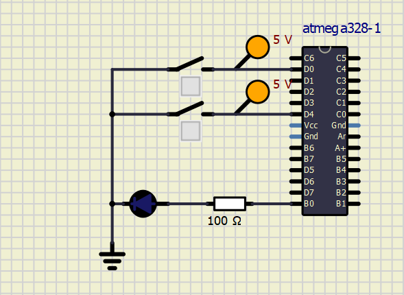
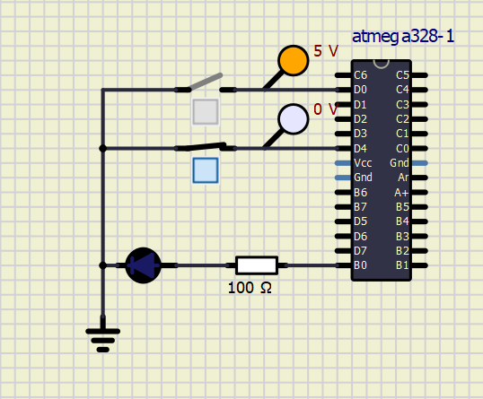
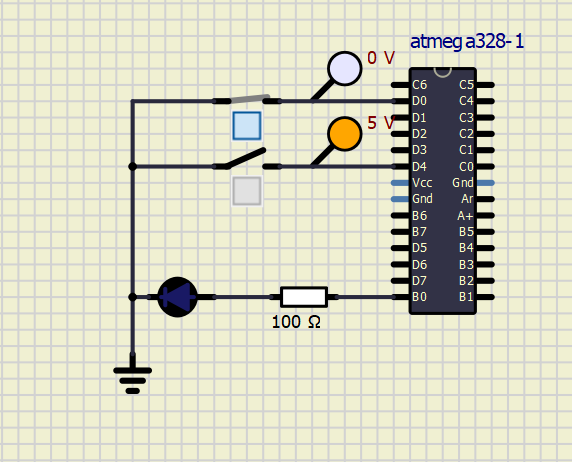
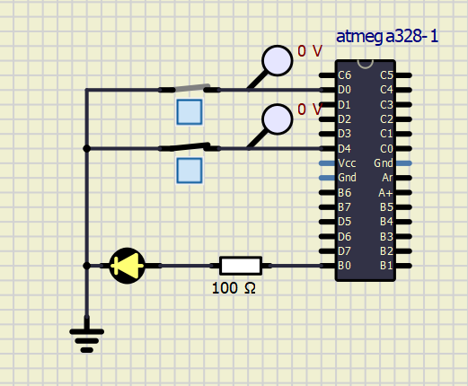
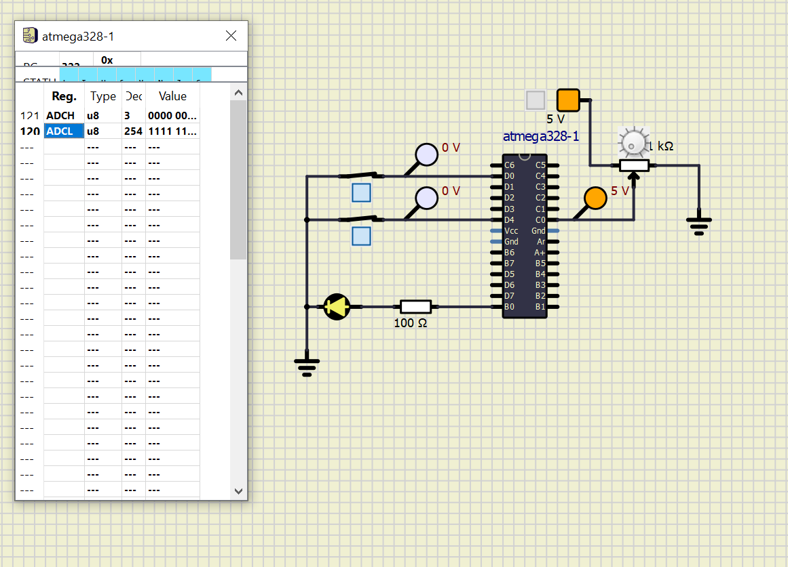
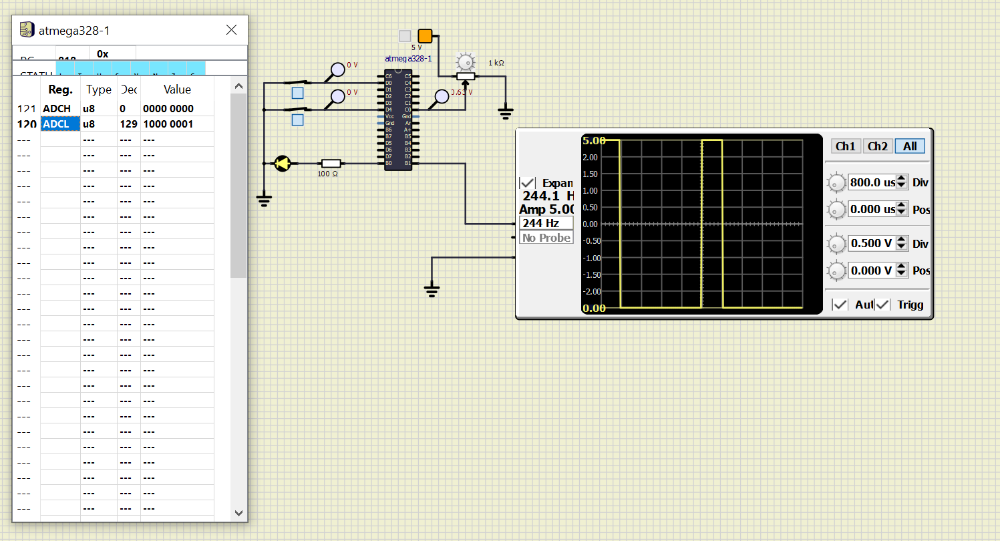
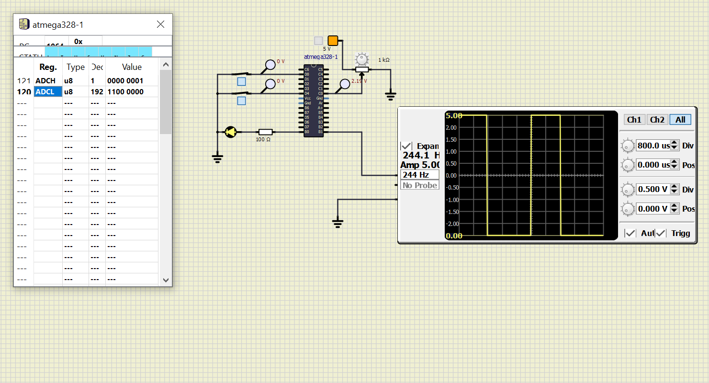
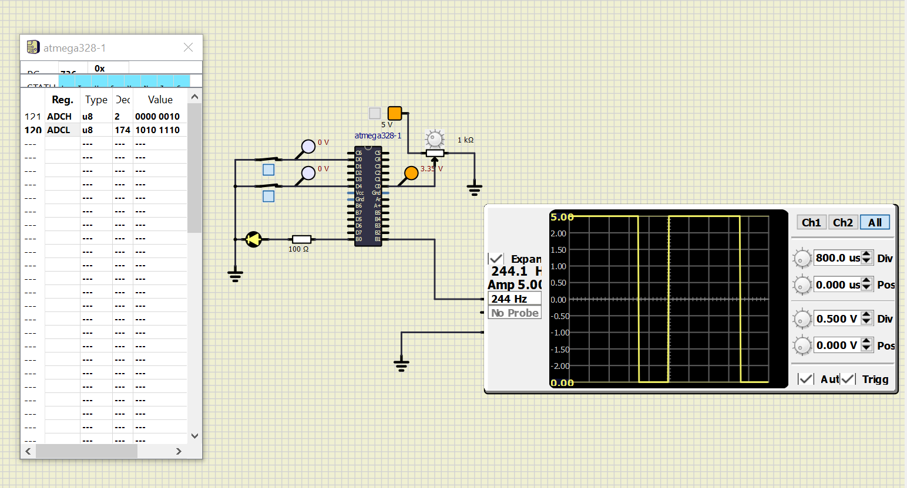
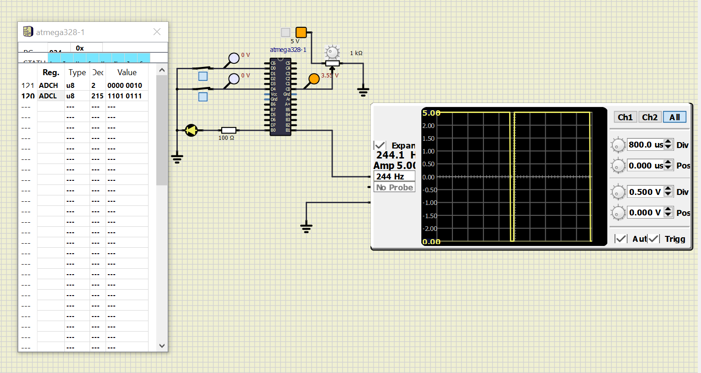

# M_Swathi_Embedded

## Activity 1

### In Action

|Logic-00|Logic-01|Logic-10|Logic-11|  
|:--:|:--:|:--:|:--:|  
|||||  
|LED OFF|LED OFF|LED OFF|LED ON| 

## Activity 2

| When LED is ON, temperature sensor gets activated and analog values get converted into digital values by ADC of the microcontroller(ATMega328)|
|:--:|
||

## Activity 3

|ADC: 0-200|ADC: 210-500|ADC: 510-700|ADC: 710-1024|
|:--:|:--:|:--:|:--:|
|||||
|20% duty cycle|40% duty cycle|70% duty cycle|95% duty cycle|
